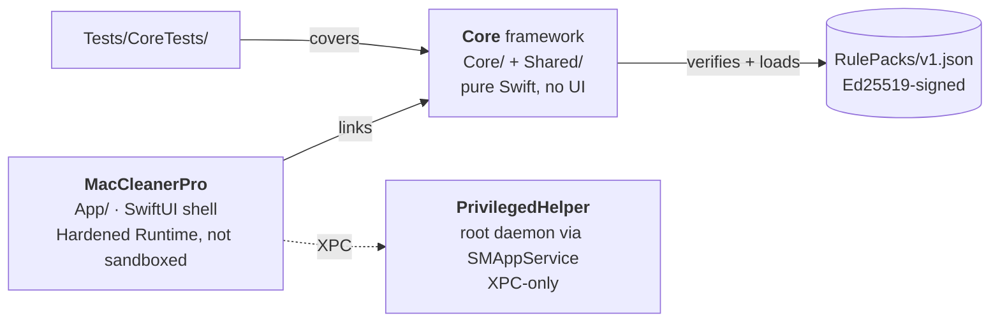

<div align="center">


# Mac Cleaner Pro

**A native, honest macOS cleaner.**

No telemetry. No cloud uploads. No subscription. Every deletion undoable.

[](https://github.com/vunexolabs/mac-cleaner-pro/actions/workflows/ci.yml)
[](#-requirements)
[](#-architecture)
[](#-architecture)
[](../../releases)
[](LICENSE)
[](#-privacy-promise)

[**Download**](#-download) · [**Quick start**](#-quick-start) · [**Features**](#-features) · [**Build from source**](#-build-from-source) · [**Architecture**](#-architecture) · [**Contributing**](#-contributing)

</div>

---

Apple's storage panel hides gigabytes behind a single opaque number called
**System Data**. Mac Cleaner Pro breaks that number down rule by rule, shows
you exactly what it found, and lets you take it back — safely.

It's free and open source (MIT), built in Swift/SwiftUI by a single indie
developer. Every feature is unlocked for everyone: no trial, no paywall, no
"Pro" upsell.

|  | |
|---|---|
| 🔒 **Nothing leaves your Mac** | No analytics, no crash pipelines, no accounts. A fresh install makes no network calls at all. |
| ↩️ **Nothing is deleted outright** | Every removal is staged in the Trash under a per-action token, so Undo works even after a relaunch. |
| ✍️ **Nothing is deleted on a guess** | The list of what's cleanable ships as an **Ed25519-signed rule pack** that the app verifies before it trusts a single path. |

---

## 📥 Download

Prebuilt releases: **[maccleanerpro.com](https://maccleanerpro.com)** or this
repo's [Releases](../../releases) page. Release notes for every version live at
**[maccleanerpro.com/changelog](https://maccleanerpro.com/changelog/)**.

Prefer to compile it yourself? See [Build from source](#-build-from-source).

### 💻 Requirements

| | |
|---|---|
| **macOS** | 13.0 Ventura or later |
| **Chips** | Apple silicon + Intel |
| **Disk** | ~20 MB |
| **Permissions** | Full Disk Access (asked for during onboarding) |

---

## 🚀 Quick start

Three steps from download to first clean — the in-app wizard walks you through
2 and 3 as well.

<table>
<tr><td align="center" width="90"><h3>1</h3></td><td>

**Install it.** Open the `.dmg` and drag **Mac Cleaner Pro** to **Applications**.

Because this build isn't notarized yet ([why](#-ship-status)), macOS asks once:
**right-click the app → Open → Open**. Every later launch is a normal
double-click.

</td></tr>
<tr><td align="center"><h3>2</h3></td><td>

**Grant Full Disk Access.** The onboarding wizard deep-links you to
**System Settings → Privacy & Security → Full Disk Access** — toggle
**Mac Cleaner Pro** on.

Without it, a scan only sees a fraction of what's reclaimable.

</td></tr>
<tr><td align="center"><h3>3</h3></td><td>

**Run Smart Scan.** Review the breakdown, untick anything you want to keep,
then hit **Clean** — and use **Undo** if you change your mind.

</td></tr>
</table>

> Full walkthrough, including uninstalling cleanly: **[docs/INSTALL.md](docs/INSTALL.md)**

---

## ✨ Features

| Module | What it does |
|---|---|
| 🧹 **Smart Scan** | A parallel Swift `TaskGroup` sweep driven by **21 signed rules** — user caches, logs, Xcode DerivedData & device support, npm / yarn / Gradle / Maven / CocoaPods caches, Safari, Chrome & Firefox caches, Mail downloads. |
| 📦 **Large & Old Files** | Pick any folder, filter by size and age, preview with **Quick Look** before you decide, then move to Trash. |
| 🌌 **Space Lens** | Treemap **and** sunburst views over a recursive, cancellable disk scan — click to drill in and find the 40 GB folder you forgot about. Both share one colour scheme, so a folder looks the same whichever you're in. |
| 🧠 **Memory Manager** | Live RAM pressure gauge, top-consumer list, and a **Quick Free** that applies memory pressure so the kernel drops cached pages — skipped outright, with a reason, when your Mac is already swapping. Quitting apps asks them politely first, so unsaved work gets its save prompt. |
| 🗑️ **App Uninstaller** | Drag-to-Trash leaves scraps behind. This finds them across **12 user-space** and **6 system-space** Library locations — containers, prefs, launch agents, HTTP storages, WebKit data and more. |
| 👯 **Duplicate Finder** | Two-pass scan: bucket by size, then confirm with **SHA-256** — no false positives, and the newest copy is pre-selected as the keeper. |
| 🛠️ **Developer Junk** | One pruned pass for `node_modules`, `.next`, `target`, `.gradle`, `Pods`, `__pycache__`, `venv`, `.tox` and friends — each confirmed by its sibling manifest (`package.json`, `Cargo.toml`, `Podfile`…) so nothing is guessed at. |
| 📜 **Activity Log** | An append-only audit trail of every clean, undo and freed byte, stored as plain JSON at `~/Library/Application Support/MacCleanerPro/activity.json` — readable without the app. |

> [!NOTE]
> A few system-level items — system cache rules and system-space uninstaller
> leftovers — are marked **"Requires helper"** in the UI and stay switched off
> until the privileged helper ships. See [Ship status](#-ship-status).

---

## 🛡️ How deletion works

The safety model is the whole point of the project, so it's worth being
explicit about it:

```
  scan  ──▶  you review  ──▶  Clean  ──▶  ~/.Trash/MacCleanerPro/<UUID>/
                                                      │
                                         Undo ◀────────┘  (survives relaunch)
```

1. **Trash-first, always.** Files are *moved* (a rename, not a copy) into
   `~/.Trash/MacCleanerPro/<UUID>/`. Nothing is ever `rm -rf`'d, including in
   the developer-junk scanner.
2. **Real Undo.** Each cleanup gets a token that is persisted to disk and
   re-hydrated at launch, so you can restore an action from the Activity Log
   even after quitting the app. Staged files stay recoverable for 30 days,
   after which a sweep clears them — or until you empty the Trash yourself,
   whichever comes first.
3. **Signed rules.** Rule packs say *which files may be deleted*, so they are
   Ed25519-signed and verified against a public key compiled into the app —
   a tampered pack is rejected outright. See
   [docs/rule-pack-signing.md](docs/rule-pack-signing.md).
4. **Conservative matching.** Uninstaller leftovers must match the app's bundle
   ID or exact name; developer artifacts must have a confirming sibling
   manifest. When in doubt, a rule is flagged **review recommended** rather than
   pre-ticked.

### 🔐 Privacy promise

No telemetry. No analytics SDK. No crash reporter. No account. No file
contents, paths, or scan results ever leave your machine — the rule pack is
bundled with the app, so a fresh install has nothing to phone home to. The one
piece of networking in the codebase is an optional revalidation call for legacy
pre-open-source license keys, and since the whole app is in this repo, you
don't have to take any of that on faith.

---

## 🔨 Build from source

**Prerequisites:** Xcode 15.3 or later (Swift 5.10) and [XcodeGen](https://github.com/yonaskolb/XcodeGen).

```sh
brew install xcodegen
git clone https://github.com/vunexolabs/mac-cleaner-pro.git
cd mac-cleaner-pro

xcodegen generate          # regenerates MacCleanerPro.xcodeproj from project.yml
open MacCleanerPro.xcodeproj
```

Or stay in the terminal:

```sh
# run the unit tests
xcodebuild -project MacCleanerPro.xcodeproj -scheme MacCleanerPro test

# archive + package a DMG into out/
./tools/build-release.sh
```

> [!IMPORTANT]
> `*.xcodeproj/` is gitignored on purpose — it is generated from
> `project.yml`, never hand-edited. Any change to targets, sources,
> entitlements or build phases goes through `project.yml`, then
> `xcodegen generate`.

---

## 🧱 Architecture

Three targets, all declared in [`project.yml`](project.yml):



| Layer | Lives in | Notes |
|---|---|---|
| **Core** | `Core/`, `Shared/` | Every domain module: `Scanner`, `RulesEngine`, `LargeFiles`, `SpaceLens`, `DuplicateFinder`, `DeveloperScanner`, `MemoryManager`, `Uninstaller`, `DeletionService`, `ActivityLog`, `HelperBridge`, `Onboarding`, `Privacy`. Pure Swift so it's testable without a host app. |
| **App** | `App/` | SwiftUI views, design system, settings, onboarding. Hardened Runtime, *not* sandboxed (it needs Full Disk Access). |
| **Helper** | `PrivilegedHelper/` | Root daemon registered through `SMAppService.daemon`; the XPC contract is `Shared/HelperProtocol.swift` and every path it touches is allowlisted. |
| **Tests** | `Tests/CoreTests/` | Unit tests target the `Core` framework — 12 suites covering scanning, deletion, licensing, rule-pack verification and more. |

Deeper dives: [rule-pack signing](docs/rule-pack-signing.md) ·
[feature/readiness matrix](docs/SHIP_READINESS.md)

---

## 🚧 Ship status

This build ships **ad-hoc signed and not notarized**, because the project
doesn't yet have a paid Apple Developer Program membership ($99/yr):

| | Status |
|---|---|
| First launch | One-time right-click → Open ([docs/INSTALL.md](docs/INSTALL.md)) |
| Privileged helper (system-level cleanup) | ⏳ Needs a Developer ID-signed binary |
| Notarization & Gatekeeper-clean launch | ⏳ Needs Developer Program membership |
| Sparkle auto-updates / Mac App Store | ⏳ Planned after the above |

Everything else runs today, in full. Closing those gaps is exactly what
[support](#-support-the-project) goes toward.

---

## 🤝 Contributing

Contributions genuinely move the needle on a solo-maintained project — a
one-line fix counts.

Especially useful right now:

- 🧪 **Testing on hardware I don't have** (older Intel Macs, other macOS point releases)
- 🧩 **New cleanup rules** for [`RulePacks/v1.json`](RulePacks/v1.json)
- 🌍 **Localization**
- 📝 **Docs fixes** and bug reports with a minimal repro

Read [CONTRIBUTING.md](CONTRIBUTING.md) for dev setup, code style and the PR
process, plus the [Code of Conduct](CODE_OF_CONDUCT.md).

---

## 💛 Support the project

Mac Cleaner Pro is free, with no ads, telemetry, or nagware. If it's useful to
you, support funds the **Apple Developer Program** membership (notarization +
the privileged helper), hosting for downloads, and time spent on maintenance
and new rule packs.

- ⭐ **Star this repo** — it's the cheapest way to help
- 🐛 **File a good bug report**, or send a PR
- ☕ **[Buy Me a Coffee](https://buymeacoffee.com/vunexolabs)** or
  **[Ko-fi](https://ko-fi.com/vunexolabs)** — both live
- 💌 Prefer something else? Reach out at **hello@maccleanerpro.com**

---

## 🔐 Security

Found a vulnerability? Please read **[SECURITY.md](SECURITY.md)** and report it
privately rather than opening a public issue.

## 📄 License

[MIT](LICENSE). The "Mac Cleaner Pro" name, logo and branding are **not**
covered by the code license — see [NOTICE.md](NOTICE.md).

<div align="center">
<br>
Built with ❤️ for the Mac — <a href="https://github.com/vunexolabs">@vunexolabs</a>
</div>
